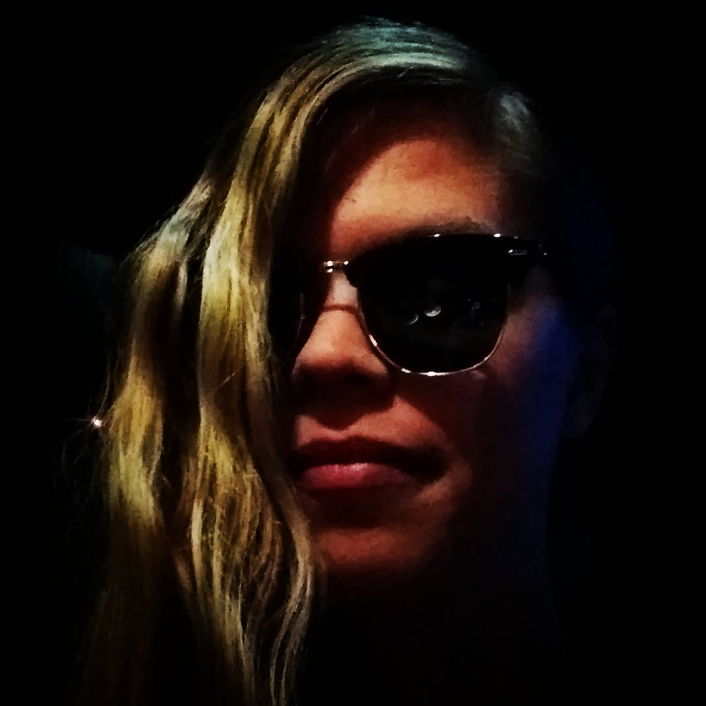

## Introduction

 Hello and welcome to my GitHub.io! I'm a Computational Linguistics student at Helsinki University. My hobbies are singing in choirs, biking and computers.

## Find me on

[LinkedIn](https://www.linkedin.com/in/laura-s-92a177113/), [GitHub](https://github.com/herpsu)

## Contact

My email address is of the form first_name.a.last_name@helsinki.fi. 

## Courses I've Taken

[Tilastotiede ja R tutuksi I](https://courses.helsinki.fi/fi/mat12001/134469088), 2020

[Ohjelmointia lingvisteille](https://courses.helsinki.fi/fi/kik-lg208/136559400), 2018

[Ohjelmoinnin perusteet](https://courses.helsinki.fi/fi/581325), 2017

[Tietokantojen perusteet](https://courses.helsinki.fi/fi/581328), 2016

[Johdatusta luonnollisen kielen käsittelyyn](https://courses.helsinki.fi/fi/406253), 2016

[Käännöstieteen perusteet](https://courses.helsinki.fi/fi/406770), 2016

[Korpuslingvistiikan johdantokurssi](https://courses.helsinki.fi/fi/406252), 2016

[Syntaksin harjoituskurssi](https://courses.helsinki.fi/fi/406249), 2016

[Kieliteknologian johdantokurssi](https://courses.helsinki.fi/fi/406715), 2016

[Yleisen kielitieteen peruskurssi](https://courses.helsinki.fi/fi/406247), 2015

[FoP1 Fonetiikan perusteet](https://courses.helsinki.fi/fi/464702), 2015

[Fonologian ja morfologian harjoituskurssi](https://courses.helsinki.fi/fi/406248), 2013

[Puheviestintä](https://courses.helsinki.fi/fi/473660), 2012

[Pääaineen TVT-opinnot/Kieliteknologian ATK-ympäristö](https://courses.helsinki.fi/fi/401051), 2010

## Projects

[My CV](https://www.overleaf.com/read/cpyxvrxstkjz)

[Repository for this page](https://github.com/herpsu/herpsu.github.io)

[Command line tools for linguists course repository](https://github.com/herpsu/cmdline-course)

## Misc. 

[Music is my life](https://en.wikipedia.org/wiki/Music)

[Highly recommended](https://en.wikipedia.org/wiki/Cantu_a_tenore)
